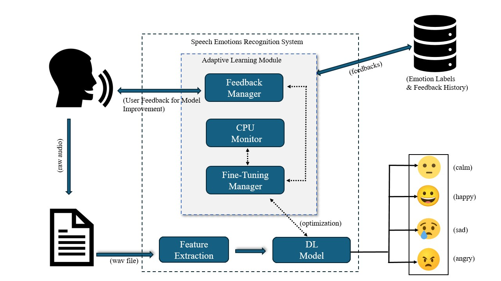

# Adaptive Speech Emotion Recognition (SER) System

## Overview

This repository contains the implementation of an Adaptive Speech Emotion Recognition (SER) system. This system dynamically learns from user feedback and optimizes its performance based on system resource availability. It utilizes a deep learning model to classify emotions from speech, a feedback manager to incorporate user corrections, a CPU monitor to ensure efficient resource usage, and a fine-tuning manager to continuously improve the model's accuracy.

## Key Features

*   **Real-time Emotion Recognition:** Classifies emotions from speech input in real-time.
*   **Adaptive Learning:** Learns from user feedback to improve accuracy over time.
*   **Resource Optimization:** Monitors CPU usage to prevent overloading and ensure efficient resource utilization.
*   **Continuous Improvement:** Automatically retrains the model during low CPU usage periods to enhance accuracy.

## System Architecture

The system comprises the following core components:

*   **DL Model:** A Convolutional Neural Network (CNN)-based model trained on speech features (Spectrograms, MFCCs) for real-time emotion classification.
*   **Feedback Manager:** Captures and stores user feedback, maintains a feedback history database, and dynamically adjusts feedback thresholds and learning rates.
*   **CPU Monitor:** Continuously monitors system CPU usage to ensure efficient resource usage.
*   **Fine-Tuning Manager:** Automatically triggers retraining of the DL model during low CPU usage periods, incorporating user feedback to enhance model accuracy.

## Setup

### Backend Setup

1.  Navigate to the `Back_end` directory: `cd Back_end`
2.  Create a virtual environment: `python3 -m venv venv`
3.  Activate the virtual environment: `source venv/bin/activate`
4.  Install the dependencies: `pip install -r requirements.txt`
5.  Run the backend server: `python back_end/main.py`

### Frontend Setup

1.  Navigate to the `front_end` directory: `cd ../front_end`
2.  Install the dependencies: `pip install -r requirements.txt`
3.  Run the frontend application: `streamlit run Home.py`

## Usage

1.  Start the backend server.
2.  Start the frontend application.
3.  Interact with the system through the frontend interface.
4.  Provide feedback on the system's predictions to help improve its accuracy.

## Contributing

Contributions are welcome! Please follow these guidelines:

1.  Fork the repository.
2.  Create a new branch for your feature or bug fix.
3.  Make your changes and commit them with descriptive messages.
4.  Submit a pull request.

## License

This project is licensed under the [License Name] License.

## Table of Contents
1. [Overview](#overview)
2. [Key Features](#key-features)
3. [System Architecture](#system-architecture)
4. [Setup](#setup)
    * [Backend Setup](#backend-setup)
    * [Frontend Setup](#frontend-setup)
5. [Usage](#usage)
6. [Contributing](#contributing)
7. [License](#license)
